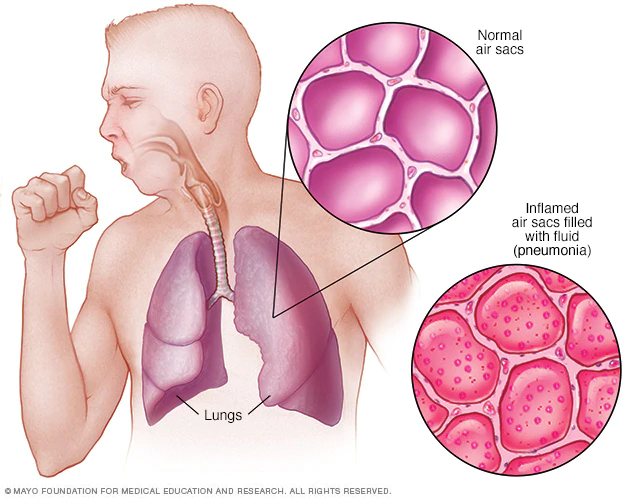

# Pneumonia-Detection-using-Convolutional-Neural-Network

## Pneumonia Detection:
Pneumonia is an infection that inflames your lungs' air sacs (alveoli). The air sacs may fill up with fluid or pus, causing symptoms such as a cough, fever, chills and trouble breathing. Bacteria and viruses are the main causes of pneumonia. Pneumonia-causing germs can settle in the alveoli and multiply after a person breathes them in. Pneumonia can be contagious. The bacteria and viruses that cause pneumonia are usually inhaled.

A pneumonia infection is no joke. In fact, UNICEF reports that pneumonia kills more children than any other illness. Even if you combined the deal toll of AIDS, measles, and malaria, you would still not have a number high enough to match that of the deaths pneumonia has caused. This dangerous infection should not be taken lightly. It is good to be acquainted with the four stages of pneumonia. The sooner you recognize the illness, the better for your recovery.

- Congestion: This stage occurs within the first 24 hours of contracting pneumonia. During congestion, the body will experience vascular engorgement, intra-alveolar fluid, and multiple bacteria. The lungs will be very heavy and red. Capillaries in the alveolar walls become congested and the infection will spread to the hilum and pleura. During this stage, a person will experience coughing and deep breathing.

- Red Hepatization: This stage occurs two to three days after congestion. At this point, the lungs will be red, firm, and airless with a resemblance to the liver. Alveolar capillaries will be engorged with blood and vascular congestion will persist. During the red hepatization stage, the alveoli will contain many erythrocytes, neutrophils, desquamated epithelial cells, and fibrin.

- Grey Hepatization: This stage will occur two to three days after red hepatization and is an avascular stage. The lungs will appear to be a grayish brown or yellow color because of the disintegration of red cells. Your lungs will also appear to be paler and drier than usual. There will be a persistence of fibrin exudate during this stage.

- Resolution: The resolution, or complete recovery, occurs when the exudate experiences progressive enzymatic digestion. This will produce debris that is eventually reabsorbed, ingested by macrophages, coughed up, or reorganized by fibroblasts.

[source: four stages of pneumonia](https://www.bassadvancedurgentcare.com/post/four-stages-of-pneumonia)

## Introduction:
In this notebook, I tried to differentiate the Normal and Pneumonia affected patients using chest X-ray images using a Lightweight Convolutional Neural Network. As a beginner myself, I searched a lot to perform prediction with higher acccuracy but less number of parameters thus know the difficulties and misunderstanding in the way. That's why, Here I will try my best to explain every steps for the sake of better understanding. Hope this will help the beginners like me to learn the basic image classification using CNN.

## Dataset Description:
The dataset was collected from the [Chest X-Ray Images (Pneumonia)](https://www.kaggle.com/paultimothymooney/chest-xray-pneumonia) dataset. It contains three folders named train (for training), val (for validation), and test (for testing). Each of them has two sub-folders with label "NORMAL" and "PENUMONIA".

- train:
 NORMAL &
 PNEUMONIA
- val:
 NORMAL &
 PNEUMONIA
- test:
 NORMAL &
 PNEUMONIA

** If you face any problem while loading the notebook, check ou this link [Pneumonia Detection using CNN](https://www.kaggle.com/alifrahman/pneumonia-detection-with-cnn-auc-score-0-94)
